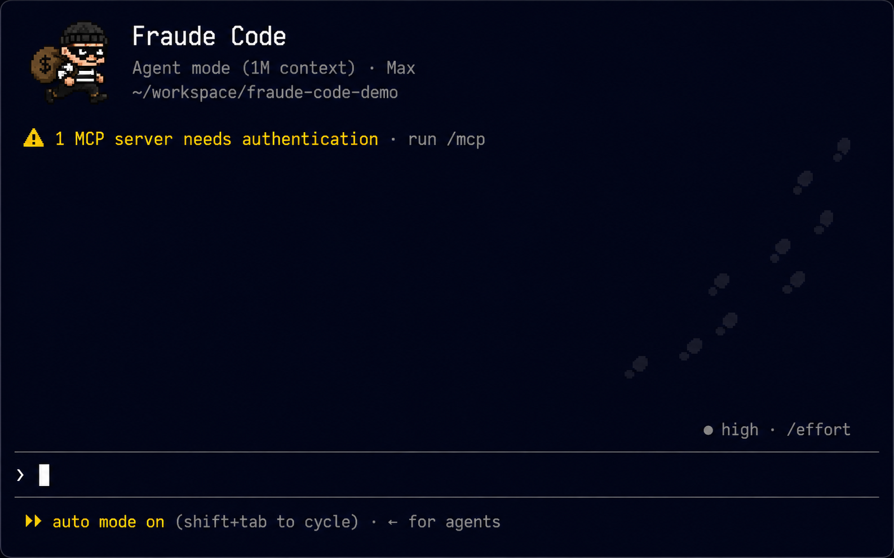

```
   ╭────────────────────────────────╮
   │        ·  ✷        ✷  ·         │
   │         ╭──────────────╮        │
   │         │ ▟▛████████▜▙  │       │
   │         │  ▀▀      ▀▀   │       │   fraude-code
   │         │   ▂    ▂      │       │   the AI is a costume;
   │         │    ╲__╱       │       │   the work is real.
   │         ╰──────────────╯        │
   │      "wanted for impersonating  │
   │       a language model"         │
   ╰────────────────────────────────╯
```

# fraude-code

<p align="center">
  
</p>

A little TUI that **looks and acts like Claude Code** — reads files, edits them, runs
shell commands — except it **never calls a model.** The tools are 100% real. The
*thinking* is a costume: a bandit in a hamburglar bandana, cheerfully doing your bidding
for **$0.00**.

*fraude* — French for "fraud." Because it is one, and proud of it.

<p align="center">
  
</p>

Above: real `ls`, a real piped shell command, a real `write` then `read` — and a cheerful
shrug when you ask it to *think*. The tools are genuine; only the brain is a costume.

## Why

- **Testing** — anything that supervises, drives, or reads coding-agent sessions (a fleet
  daemon, a terminal harness, a browser side-panel) needs *something in the tmux pane that
  behaves like Claude Code*. Driving a real one burns tokens on every nudge. fraude-code
  behaves like the real thing and spends nothing.
- **Demos** — show the shape of an agent workflow without an API key or a bill.
- **The bit** — it's funny. A wanted poster for a model impersonator.

## Install

Built with [Ink](https://github.com/vadimdemedes/ink) — React for terminals, the same
stack Claude Code itself uses. That's why the box, the live input, and the colour
pixel-art octopus render like the real thing.

```
npm install
npm run build
node dist/cli.js          # or: npm link, then `fraude`
```

## Use

It's a REPL. Type in plain-ish language; the fraud "understands" you with cheap
pattern-matching and then does the **real** thing:

```
❯ read src/app.tsx        # actually reads and prints the file
❯ ls src                  # actually lists the directory
❯ run npm test            # actually runs it (pipes/globs work — it's a real shell)
❯ ! git status            # ! is shorthand for run
❯ write hi.txt: hello     # actually writes the file
❯ what's the meaning of life?   # shrugs cutely — it can't think, remember
❯ /help
❯ /exit
```

## What's real vs. fake

| Real (it does this) | Fake (it fakes this) |
|---|---|
| reading, listing, writing files | understanding your intent (regex, not a model) |
| running shell commands | the "✷ frauding…" thinking spinner |
| the file contents, the command output | the eager little personality |

Everything that touches your machine is genuine. The only thing missing is the part that
costs money — which is the whole point.

## Not this

Not a jailbreak, not a model, not a wrapper around one. There is no API key field because
there is no API. If it ever tries to charge you, it's not fraude-code — *that* would be
the real fraud.

MIT licensed. Impersonate responsibly.
